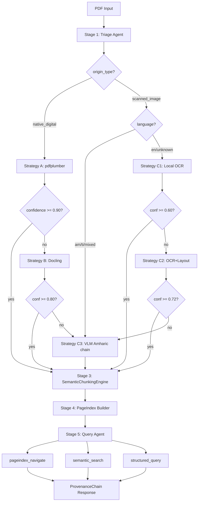

# DOMAIN_NOTES.md — Document Intelligence Refinery

## Phase 0: Document Science Analysis

### Extraction Strategy Decision Tree
```
PDF Input
├── image_area_ratio >= 0.55 AND avg_chars/page <= 300?
│   └── origin_type = scanned_image
│       ├── language = am/ti/mixed? → Skip C1+C2 → C3 (VLM, Amharic chain)
│       └── language = en? → C1 (local OCR) → C2 (layout OCR) → C3 (VLM)
└── else: origin_type = native_digital
    ├── single_column? → Strategy A (pdfplumber) confidence >= 0.90? → ACCEPT
    │                                               else → escalate to B
    ├── multi_column / table_heavy? → Strategy B (Docling)
    │   confidence >= 0.80? → ACCEPT
    │   else → escalate to C
    └── confidence < threshold at any stage → Strategy C (VLM chain)
```

### Empirical Thresholds (defined from Phase 0 analysis)

| Signal | Scanned threshold | Notes |
|--------|------------------|-------|
| avg_image_area_ratio | >= 0.55 | Images dominate page |
| avg_text_chars/page | <= 300 | No meaningful text layer |
| Strategy A min confidence | 0.90 | conf = 0.60 + chars/2000, capped 0.95 |
| Strategy B min confidence | 0.80 | Docling markdown length heuristic |
| Strategy C C1 threshold | 0.60 | Local OCR char count |
| Strategy C C2 threshold | 0.72 | Layout OCR + structure |

### Observed Failure Modes

**Class A (CBE Annual Report — native digital, multi-column):**
- Strategy A produces correct text but loses column reading order on 2-col pages
- Tables in multi-column layouts get cell boundaries merged into a single text block
- Fix: escalate to Strategy B (Docling) which reconstructs reading order

**Class B (DBE Audit Report — scanned image):**
- pdfplumber extracts zero characters (no text layer)
- Strategy A confidence = 0.25 → automatically escalates
- Tesseract (C1) struggles with Amharic/Ethiopic script in scanned pages
- Fix: Amharic fast-path skips C1+C2, goes direct to C3 (VLM with Ethiopic prompt)

**Class C (FTA Survey — mixed):**
- Pages alternate between text-heavy and table-heavy layouts
- Strategy A gets good text but misses table structure
- Fix: layout_complexity detection triggers Strategy B for table-heavy pages

**Class D (Tax Expenditure — table-heavy):**
- Multi-year fiscal tables span full page width
- Token-count chunking bisects tables causing hallucinated totals
- Fix: R1 in SemanticChunkingEngine forces every table to standalone LDU

### VLM Cost Tradeoff Analysis

| Strategy | Tool | Cost/doc | When to use |
|----------|------|----------|-------------|
| A | pdfplumber | ~$0.00 | native_digital + single_column |
| B | Docling | ~$0.01 (compute) | multi_column, table_heavy, mixed |
| C1 | PyMuPDF text | ~$0.00 | scanned, English, low confidence |
| C2 | PyMuPDF + layout | ~$0.00 | scanned, structure needed |
| C3 | OpenRouter VLM (free) | $0.00 | scanned, Amharic, all else fails |

**Client conversation talking point:** For a 400-page scanned Amharic report, Strategy C3 adds ~15s latency per page but costs $0 on free-tier models. For an English native-digital report, Strategy A costs <1s and $0. The escalation guard prevents running C3 unnecessarily — it only fires when A and B genuinely fail.

### Pipeline Diagram (Mermaid)
