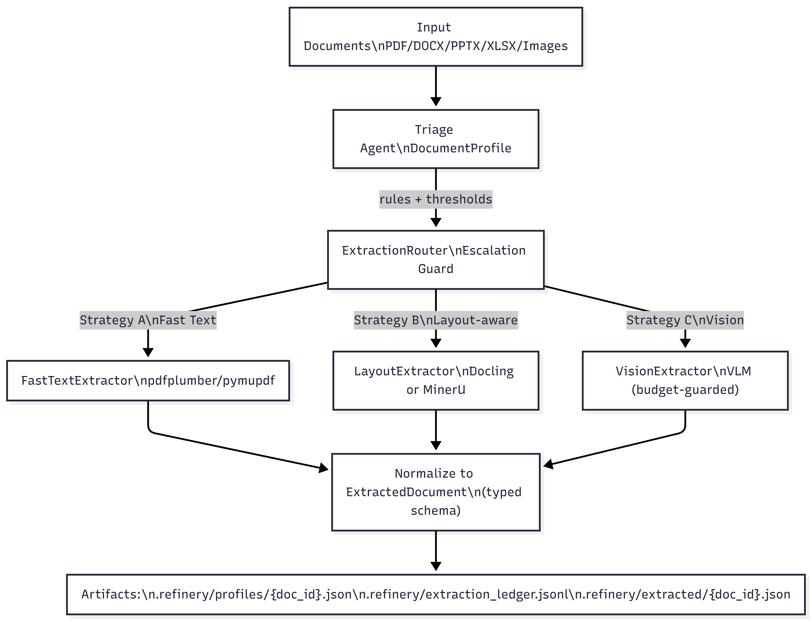

# Document Intelligence Refinery

**TRP1 – Week 3: Document Intelligence Pipeline**

## Overview

Document Intelligence Refinery is an adaptive document processing system that analyzes heterogeneous documents (PDF, DOCX, PPTX, XLSX, images) and dynamically selects the most suitable extraction strategy.

The system uses a **triage agent**, routing logic, and multiple extraction strategies to balance **cost, speed, and extraction quality**.

The pipeline generates structured artifacts and maintains a transparent **decision ledger** that records extraction strategies, confidence scores, processing time, and cost estimates.

---

## System Architecture



The pipeline follows a staged architecture:

### 1. Input Layer

Documents are ingested from the dataset directory. Supported formats include:

* PDF
* DOCX
* PPTX
* XLSX
* Images

Example input path:

```
data/raw/
```

---

### 2. Triage Agent

The **Triage Agent** analyzes each document and produces a `DocumentProfile`.

It computes signals such as:

* `origin_type` (native text vs scanned image)
* `layout_complexity`
* `avg_text_chars_per_page`
* `avg_image_area_ratio`

These signals determine the most suitable extraction strategy.

---

### 3. Extraction Router

The **Extraction Router** selects an extraction strategy based on triage signals and predefined rules from:

```
rubric/extraction_rules.yaml
```

Routing decisions also consider:

* confidence thresholds
* escalation policies
* estimated extraction cost

---

### 4. Extraction Strategies

The system supports three extraction strategies.

#### Strategy A — Fast Text Extraction

Used for documents that contain native text.

Tools:

* `pdfplumber`
* `PyMuPDF`

Characteristics:

* very fast
* low cost
* suitable for digital PDFs

---

#### Strategy B — Layout-Aware Extraction

Used for complex or scanned documents.

Tools:

* `Docling`
* OCR via RapidOCR

Capabilities:

* layout analysis
* OCR for scanned documents
* improved reading order

This is the **primary strategy used in the interim submission**.

---

#### Strategy C — Vision / VLM Extraction

Designed for difficult documents requiring visual understanding.

Examples:

* forms
* diagrams
* heavily scanned files

This strategy is **budget-guarded** and reserved for advanced processing in the final submission.

---

### 5. Normalization Layer

All extraction outputs are normalized into a unified schema:

```
ExtractedDocument
```

The schema contains:

* document id
* extraction strategy used
* confidence score
* extracted blocks
* provenance metadata

This ensures consistent downstream processing regardless of extraction strategy.

---

### 6. Artifact Generation

The pipeline produces structured artifacts in the `.refinery` directory.

```
.refinery/
 ├── profiles/
 │   └── {doc_id}.json
 │
 ├── extracted/
 │   └── {doc_id}.json
 │
 └── extraction_ledger.jsonl
```

#### profiles/

Contains triage results (`DocumentProfile`).

#### extracted/

Contains normalized extraction output (`ExtractedDocument`).

#### extraction_ledger.jsonl

An append-only ledger recording:

* strategy used
* confidence score
* processing time
* estimated cost
* triage signals

This provides full **traceability of extraction decisions**.

---

## Example Ledger Entry

```
{
  "doc_id": "2013-E.C-Procurement-information",
  "strategy_used": "B",
  "confidence": 0.75,
  "cost_estimate_usd": 0.01,
  "processing_time_s": 131.03,
  "signals": {
    "origin_type": "scanned_image",
    "layout_complexity": "mixed",
    "avg_text_chars_per_page": 0.0,
    "avg_image_area_ratio": 1.0
  }
}
```

---

## Project Structure

```
document-intelligence-refinery/

src/
 ├── agents/
 │   └── triage.py
 │
 ├── strategies/
 │   ├── fast_text.py
 │   ├── layout_docling.py
 │   └── vision_vlm.py
 │
 ├── models/
 │   ├── document_profile.py
 │   └── extracted_document.py
 │
 ├── router.py
 ├── settings.py
 └── main.py

rubric/
 └── extraction_rules.yaml

data/
 └── raw/

.refinery/
 ├── profiles/
 ├── extracted/
 └── extraction_ledger.jsonl
```

---

## Running the Pipeline

Activate the virtual environment:

```
source .venv/bin/activate
```

Run the pipeline:

```
refinery --input-path data/raw --limit 4
```

Example output:

```
Processing 4 PDF(s)...
2013-E.C-Assigned-regular-budget-and-expense.pdf -> strategy B, confidence=0.75
2013-E.C-Audit-finding-information.pdf -> strategy B, confidence=0.55
2013-E.C-Procurement-information.pdf -> strategy B, confidence=0.75
2018_Audited_Financial_Statement_Report.pdf -> strategy B, confidence=0.75
```

Artifacts will be generated in:

```
.refinery/
```

---

## Interim Implementation Scope

The interim implementation includes:

* document triage and profiling
* strategy routing
* Strategy A (text extraction)
* Strategy B (layout-aware OCR extraction)
* extraction normalization
* decision ledger and artifact generation

---

## Planned Improvements (Final Submission)

Future enhancements will include:

* Strategy C vision-based extraction using VLMs
* improved OCR language handling
* page-level provenance tracking
* structured table extraction
* enhanced confidence scoring

---

## Key Design Goals

* adaptive extraction strategy selection
* transparent decision logging
* cost-aware document processing
* modular extraction architecture

---

## Author

Meseret Bolled
Software Engineering Student
Addis Ababa Science and Technology University
